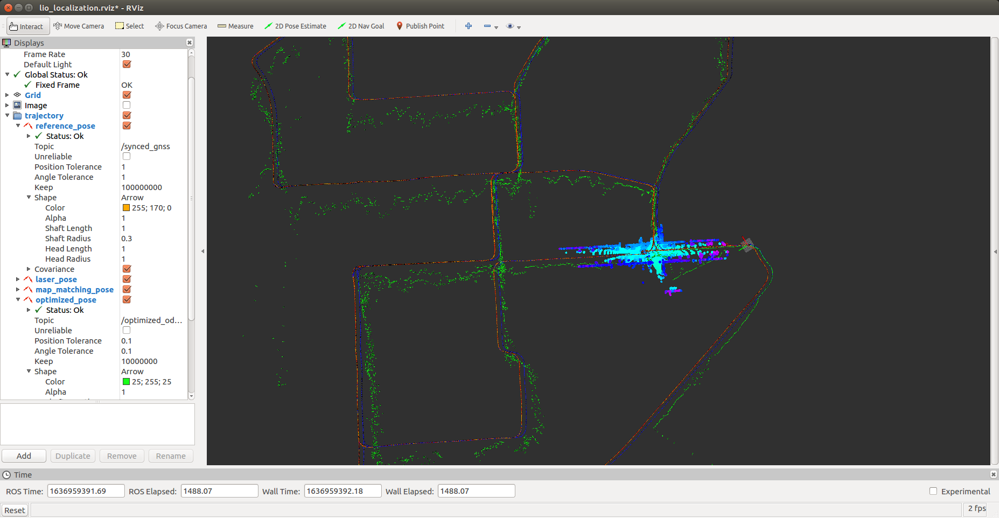

# 补全代玛，并梳理关键逻辑

本次作业的关键是基于滑动窗口边缘化的融合定位，其中关键的逻辑是边缘化的实现，相比于视觉VIO中一个地图点可能被多个观测帧所看到而导致边缘化的操作十分复杂。在雷达LIO的框架中，一般来说约束只会与最多两帧的状态有关，所以边缘化的实现其实就是在窗口的第一帧和第二帧之中将第一帧边缘化。

其中构建边缘化的关键流程如下

```cpp
        // TODO: add residual blocks:
        // b.1. marginalization constraint:
        if (
            !residual_blocks_.map_matching_pose.empty() && 
            !residual_blocks_.relative_pose.empty() && 
            !residual_blocks_.imu_pre_integration.empty()
        ) {
            auto &key_frame_m = optimized_key_frames_.at(N - kWindowSize - 1);
            auto &key_frame_r = optimized_key_frames_.at(N - kWindowSize - 0);

            const ceres::CostFunction *factor_map_matching_pose = GetResMapMatchingPose(
                residual_blocks_.map_matching_pose.front()
            );
            const ceres::CostFunction *factor_relative_pose = GetResRelativePose(
                residual_blocks_.relative_pose.front()
            );
            const ceres::CostFunction *factor_imu_pre_integration = GetResIMUPreIntegration(
                residual_blocks_.imu_pre_integration.front()
            );

            sliding_window::FactorPRVAGMarginalization *factor_marginalization = new sliding_window::FactorPRVAGMarginalization();

            factor_marginalization->SetResMapMatchingPose(
                factor_map_matching_pose, 
                std::vector<double *>{key_frame_m.prvag}
            );
            factor_marginalization->SetResRelativePose(
                factor_relative_pose,
                std::vector<double *>{key_frame_m.prvag, key_frame_r.prvag}
            );
            factor_marginalization->SetResIMUPreIntegration(
                factor_imu_pre_integration,
                std::vector<double *>{key_frame_m.prvag, key_frame_r.prvag}
            );
            factor_marginalization->Marginalize(key_frame_r.prvag);

        }
```

其中和第一帧与第二帧相关的主要是第一帧的由雷达重定位获得的单边约束，第一帧和第二帧之间的雷达相对位姿和IMU预积分约束。

* 雷达位姿单边约束

  ```cpp
    void SetResMapMatchingPose(
      const ceres::CostFunction *residual,
      const std::vector<double *> &parameter_blocks
    ) {
      // init:
      ResidualBlockInfo res_map_matching_pose(residual, parameter_blocks);
      Eigen::VectorXd residuals;
      std::vector<Eigen::Matrix<double, Eigen::Dynamic, Eigen::Dynamic, Eigen::RowMajor>> jacobians;
  
      // compute:
      Evaluate(res_map_matching_pose, residuals, jacobians);
      const Eigen::MatrixXd &J_m = jacobians.at(0);
  
      //
      // TODO: Update H:
      //
      // a. H_mm:
      H_.block<15, 15>(INDEX_M, INDEX_M) += J_m.transpose() * J_m;
  
      //
      // TODO: Update b:
      //
      // a. b_m:
      b_.block<15,  1>(INDEX_M,       0) += J_m.transpose() * residuals;
    }
  ```

  由于是单边约束，所以这里面的H矩阵只有最左上角的一部分，同样b也只有最上面一部分。

* 雷达相对位姿和IMU预积分约束

  ```cpp
    void SetResIMUPreIntegration(
      const ceres::CostFunction *residual,
      const std::vector<double *> &parameter_blocks
    ) {
      // init:
      ResidualBlockInfo res_imu_pre_integration(residual, parameter_blocks);
      Eigen::VectorXd residuals;
      std::vector<Eigen::Matrix<double, Eigen::Dynamic, Eigen::Dynamic, Eigen::RowMajor>> jacobians;
  
      // compute:
      Evaluate(res_imu_pre_integration, residuals, jacobians);
      const Eigen::MatrixXd &J_m = jacobians.at(0);
      const Eigen::MatrixXd &J_r = jacobians.at(1);
  
      //
      // TODO: Update H:
      //
      // a. H_mm:
      H_.block<15, 15>(INDEX_M, INDEX_M) += J_m.transpose() * J_m;
      // b. H_mr:
      H_.block<15, 15>(INDEX_M, INDEX_R) += J_m.transpose() * J_r;
      // c. H_rm:
      H_.block<15, 15>(INDEX_R, INDEX_M) += J_r.transpose() * J_m;
      // d. H_rr:
      H_.block<15, 15>(INDEX_R, INDEX_R) += J_r.transpose() * J_r;
  
  
      //
      // Update b:
      //
      // a. b_m:
      b_.block<15,  1>(INDEX_M,       0) += J_m.transpose() * residuals;
      // a. b_r:
      b_.block<15,  1>(INDEX_R,       0) += J_r.transpose() * residuals;
    }  
  	void SetResRelativePose(
      const ceres::CostFunction *residual,
      const std::vector<double *> &parameter_blocks
    ) {
      // init:
      ResidualBlockInfo res_relative_pose(residual, parameter_blocks);
      Eigen::VectorXd residuals;
      std::vector<Eigen::Matrix<double, Eigen::Dynamic, Eigen::Dynamic, Eigen::RowMajor>> jacobians;
  
      // compute:
      Evaluate(res_relative_pose, residuals, jacobians);
      const Eigen::MatrixXd &J_m = jacobians.at(0);
      const Eigen::MatrixXd &J_r = jacobians.at(1);
  
      //
      // TODO: Update H:
      //
      // a. H_mm:
      H_.block<15, 15>(INDEX_M, INDEX_M) += J_m.transpose() * J_m;
      // b. H_mr:
      H_.block<15, 15>(INDEX_M, INDEX_R) += J_m.transpose() * J_r;
      // c. H_rm:
      H_.block<15, 15>(INDEX_R, INDEX_M) += J_r.transpose() * J_m;
      // d. H_rr:
      H_.block<15, 15>(INDEX_R, INDEX_R) += J_r.transpose() * J_r;
  
      //
      // TODO: Update b:
      //
      // a. b_m:
      b_.block<15,  1>(INDEX_M,       0) += J_m.transpose() * residuals;
      // a. b_r:
      b_.block<15,  1>(INDEX_R,       0) += J_r.transpose() * residuals;
    }
  ```

  雷达相对位姿和IMU预积分为双边约束，所以对于第一帧和第二帧各15维的状态都有约束，H矩阵分为了四块，b矩阵也被分为了两部分

在构建完关于第一帧和第二帧状态的H和b矩阵之后，就需要利用舒尔补来进行边缘化

```cpp
void Marginalize(
    const double *raw_param_r_0
  ) {
    // TODO: implement marginalization logic
        // save x_m_0:
    Eigen::Map<const Eigen::Matrix<double, 15, 1>> x_0(raw_param_r_0);
    x_0_ = x_0;

    // marginalize:
    const Eigen::MatrixXd &H_mm = H_.block<15, 15>(INDEX_M, INDEX_M);
    const Eigen::MatrixXd &H_mr = H_.block<15, 15>(INDEX_M, INDEX_R);
    const Eigen::MatrixXd &H_rm = H_.block<15, 15>(INDEX_R, INDEX_M);
    const Eigen::MatrixXd &H_rr = H_.block<15, 15>(INDEX_R, INDEX_R);

    const Eigen::VectorXd &b_m = b_.block<15, 1>(INDEX_M, 0);
    const Eigen::VectorXd &b_r = b_.block<15, 1>(INDEX_R, 0);

    //
    // TODO: shall we improve numeric stability following VIO/LIO-mapping's practice?
    //
    Eigen::MatrixXd H_mm_inv = H_mm.inverse();
    Eigen::MatrixXd H_marginalized = H_rr - H_rm * H_mm_inv * H_mr;
    Eigen::MatrixXd b_marginalized = b_r - H_rm * H_mm_inv * b_m;

    //
    // solve linearized residual & Jacobian:
    // 
    Eigen::SelfAdjointEigenSolver<Eigen::MatrixXd> saes(H_marginalized);
    Eigen::VectorXd S = Eigen::VectorXd(
      (saes.eigenvalues().array() > 1.0e-5).select(saes.eigenvalues().array(), 0)
    );
    Eigen::VectorXd S_inv = Eigen::VectorXd(
      (saes.eigenvalues().array() > 1.0e-5).select(saes.eigenvalues().array().inverse(), 0)
    );

    Eigen::VectorXd S_sqrt = S.cwiseSqrt();
    Eigen::VectorXd S_inv_sqrt = S_inv.cwiseSqrt();

    // finally:
    J_ = S_sqrt.asDiagonal() * saes.eigenvectors().transpose();
    e_ = S_inv_sqrt.asDiagonal() * saes.eigenvectors().transpose() * b_marginalized;
  }
```

这里面的具体逻辑与ppt一致，需要注意的是如何从H和b矩阵中获得相应的雅各比和残差。这里我们使用奇异值分解
$$
H = J^TJ = QSQ^T
$$
其中$S$为奇异值，$Q$为奇异值对应的右奇异向量，那么
$$
J = \sqrt{S}Q^T
$$
根据$b = J^Te$可以得到
$$
e = {J^T}^{-1}b = \sqrt{S^{-1}}Q^T
$$
最后就是利用前面边缘化后得到的雅各比和残差来构造对于边缘化后的第一帧也就是原来的第二帧的约束

```cpp
 // add marginalization factor into sliding window
            problem.AddResidualBlock(
                factor_marginalization,
                NULL,
                key_frame_r.prvag
            );

            residual_blocks_.map_matching_pose.pop_front();
            residual_blocks_.relative_pose.pop_front();
            residual_blocks_.imu_pre_integration.pop_front();
```

其中对于`factor_marginalization`实现了`Evaluate`的函数，完成了在`ceres`调用时利用提前计算好的雅各比和线性化点来更新当前的残差

```cpp
  virtual bool Evaluate(double const *const *parameters, double *residuals, double **jacobians) const {	
    //
    // parse parameters:
    //
    Eigen::Map<const Eigen::Matrix<double, 15, 1>> x(parameters[0]);
    Eigen::VectorXd dx = x - x_0_;

    //
    // TODO: compute residual:
    //
    Eigen::Map<Eigen::Matrix<double, 15, 1>> residual(residuals);
    residual = e_ + J_ * dx;

    //
    // TODO: compute jacobian:
    //
    if ( jacobians ) {
      if ( jacobians[0] ) {
        // implement computing:
        Eigen::Map<Eigen::Matrix<double, 15, 15, Eigen::RowMajor> > jacobian_marginalization( jacobians[0] );
        jacobian_marginalization.setZero();

        jacobian_marginalization = J_;
      }
    }

    return true;
  }
```

这里其实有一个课上没有提到但是在相关文献中被提到的问题，就是`FEJ`,也就是对于被边缘化后留下来的变量来说，后续和他相关的残差的雅各比都应该用边缘化时的状态来进行线性化，而不是使用优化后的状态。这么做的最直观的解释就是由于边缘化约束和后续其他约束对于对于这个状态的线性化点不同，从而会人为引入一些错误的消息，可能导致整个优化程序的崩溃。当然，这个只是理论上的解释，在`VINS`中也没有使用这个方法，但是在一些其他的框架中这种方法也会被经常看到。

# 与EKF进行对比





从图中可以看出，基于滑动窗口VIO的定位在精度上要低于基于EKF的定位，但是在轨迹平滑性有了大幅度的提升，可能有以下原因

* 基于滑动窗口的VIO融合的单边位姿是点云在地图中重定位得到的，而EKF章节中使用的就是参考轨迹GNSS的位姿态，那么当以GNSS作为真值时，滑动窗口VIO的精度会较低。
* 边缘化处理中未使用`FEJ`公式，而是在不同点进行了线性化，这可能会造成错误的约束。
* 关键帧之间的距离选取不合适，导致预积分量的误差较大
* 边缘化信息没有随着窗口的滑动而传递
* 原始数据存在问题

同时我们可以发现，VIO的结果在开始路段的附近要显著的好于EKF

